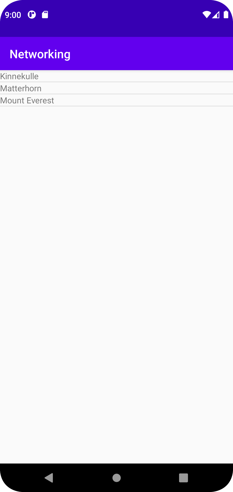

# Rapport

**
fösta jag adderat en listview layout för att läsa jason item. jag adderat också Mountain,java jag användar varible namn
Till exempel Berg namn  och storleksfälten meter och fot över havet i bergsexemplet. Sen jag användar daptern för att tillhandahålla vyer för en AdapterView, Returnerar en vy för varje objekt i en samling dataobjekt du tillhandahåller och kan användas med listbaserade användargränssnittswidgets.

```
Gson gson = new Gson();
mountains = gson.fromJson(json,Mountain[].class);
```

Den här element hälpt mig användas för att konvertera Java-objekt till deras JSON-representation. Den kan också användas för att konvertera en JSON-sträng till ett likvärdigt Java-objekt. Gson kan arbeta med godtyckliga Java-objekt inklusive objekt som du inte har källan till.

```
ArrayAdapter<Mountain> arrayAdapter = new ArrayAdapter<>(this, R.layout.listview_item, R.id.item, mountains);

```
En adapter som hjälpte mig  fungerar som en brygga mellan en AdapterView och de underliggande data för den view.
```
 ListView listView = findViewById(R.id.list_view);
        listView.setAdapter(arrayAdapter);
        listView.setOnItemClickListener(new AdapterView.OnItemClickListener() {
            @Override
            public void onItemClick(AdapterView<?> adapterView, View view, int i, long l) {

            }
        });

```
Den här hur jag koppla mellen ListView och adapter.
**

_Du kan ta bort all text som finns sedan tidigare_.

## Följande grundsyn gäller dugga-svar:

- Ett kortfattat svar är att föredra. Svar som är längre än en sida text (skärmdumpar och programkod exkluderat) är onödigt långt.
- Svaret skall ha minst en snutt programkod.
- Svaret skall inkludera en kort övergripande förklarande text som redogör för vad respektive snutt programkod gör eller som svarar på annan teorifråga.
- Svaret skall ha minst en skärmdump. Skärmdumpar skall illustrera exekvering av relevant programkod. Eventuell text i skärmdumpar måste vara läsbar.
- I de fall detta efterfrågas, dela upp delar av ditt svar i för- och nackdelar. Dina för- respektive nackdelar skall vara i form av punktlistor med kortare stycken (3-4 meningar).

Programkod ska se ut som exemplet nedan. Koden måste vara korrekt indenterad då den blir lättare att läsa vilket gör det lättare att hitta syntaktiska fel.

```
  Gson gson = new Gson();
        mountains = gson.fromJson(json,Mountain[].class);

        ArrayAdapter<Mountain> arrayAdapter = new ArrayAdapter<>(this, R.layout.listview_item, R.id.item, mountains);

        ListView listView = findViewById(R.id.list_view);
        listView.setAdapter(arrayAdapter);
        listView.setOnItemClickListener(new AdapterView.OnItemClickListener() {
            @Override
            public void onItemClick(AdapterView<?> adapterView, View view, int i, long l) {

            }
        });

        for (int i = 0; i < mountains.length; i++) {
            Log.d("MainActivity ==>","Hittade ett berg" +  mountains[i].getName() + " " + mountains[i].getAuxdata().getWiki());


        }
```

Bilder läggs i samma mapp som markdown-filen.



Läs gärna:

- Boulos, M.N.K., Warren, J., Gong, J. & Yue, P. (2010) Web GIS in practice VIII: HTML5 and the canvas element for interactive online mapping. International journal of health geographics 9, 14. Shin, Y. &
- Wunsche, B.C. (2013) A smartphone-based golf simulation exercise game for supporting arthritis patients. 2013 28th International Conference of Image and Vision Computing New Zealand (IVCNZ), IEEE, pp. 459–464.
- Wohlin, C., Runeson, P., Höst, M., Ohlsson, M.C., Regnell, B., Wesslén, A. (2012) Experimentation in Software Engineering, Berlin, Heidelberg: Springer Berlin Heidelberg.
